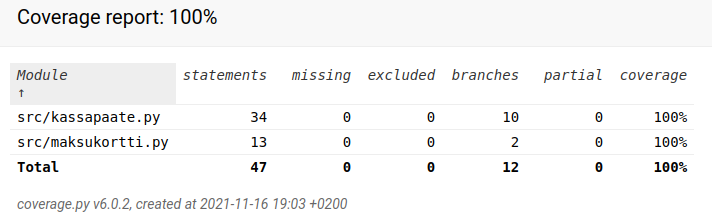

# Ohjelmistotekniikka

## Harjoitustyö – Yatzy

[Vaatimusmäärittely](dokumentaatio/vaatimusmaarittely.md)

[Työaikakirjanpito](dokumentaatio/tyoaikakirjanpito.md)

## Tehtävät

### Viikko 1

[gitlog.txt](laskarit/viikko1/gitlog.txt)

[komentorivi.txt](laskarit/viikko1/komentorivi.txt)
(valitettavasti ilman rivinvaihtoja, sillä kopioitu Windowsin leikepöydän kautta)

Ylimääräinen rivi tekstiä tehtävää varten

Tämä on muutos konfliktin harjoittelua varten

### Viikko 2

[maksukortti](laskarit/viikko2/maksukortti)

[unicafe](laskarit/viikko2/unicafe)

